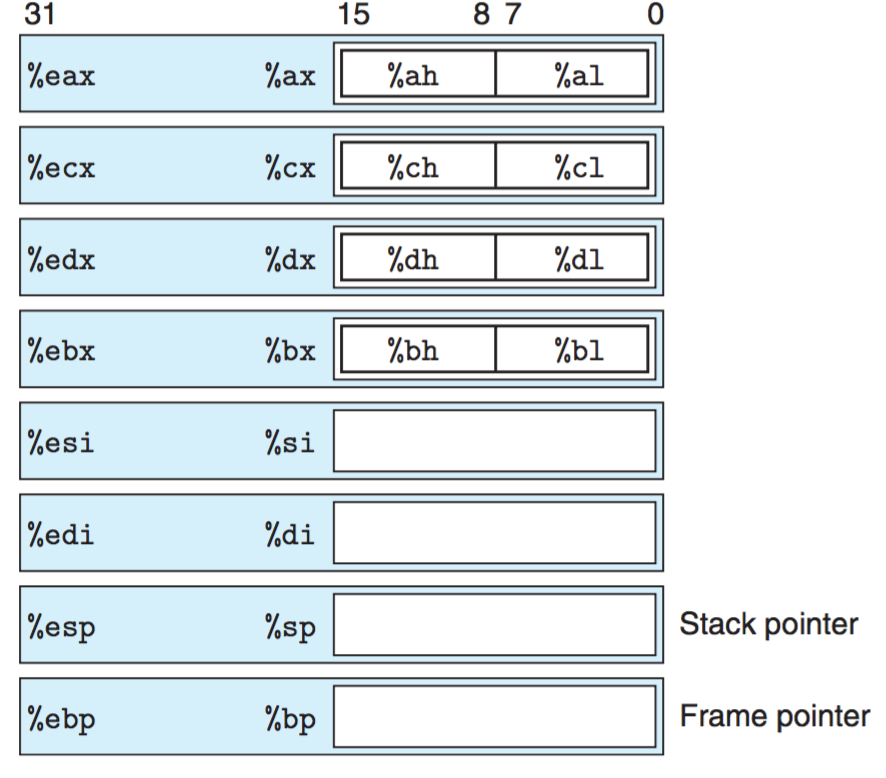
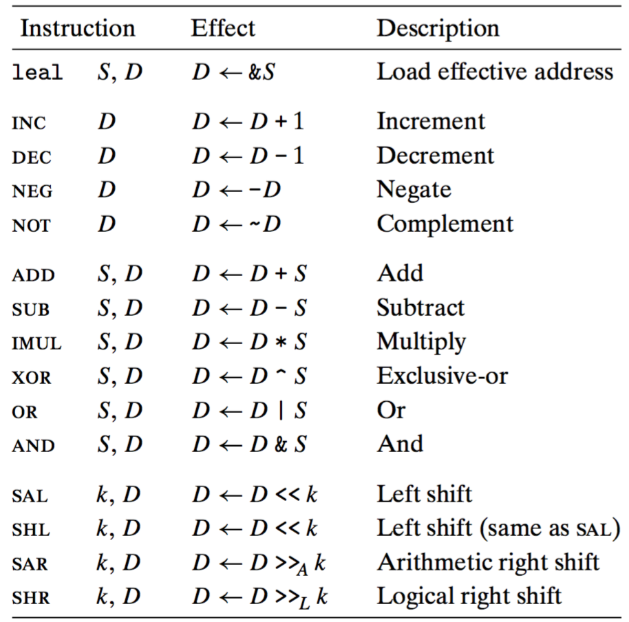

# 程序的机器级表示
---


> ## 精通细节是理解更深和更基本概念的先决条件 "This is a subject where mastering the details is a prerequisite to understanding the deeper and more fundamental concepts"

### 机器级编程的2种抽象：指令集结构，虚拟地址

### 使用反汇编器，64位系统下指定-m32生成32位的，和书中给出的代码不一样，所以阅读本章的目的是读懂汇编代码

```
Disassembly of section .text:

0000000000000000 <sum>:
   0:	8d 04 37             	lea    (%rdi,%rsi,1),%eax
   3:	01 05 00 00 00 00    	add    %eax,0x0(%rip)        # 9 <sum+0x9>
   9:	c3                   	retq   
```
指定-m32：

```
00000000 <sum>:
   0:	8b 44 24 08          	mov    0x8(%esp),%eax
   4:	03 44 24 04          	add    0x4(%esp),%eax
   8:	01 05 00 00 00 00    	add    %eax,0x0
   e:	c3                   	ret    

```

### IA32整数寄存器


### 数据传送示例-P116
[exchange.c](exchange.c)

```
vonzhou@ubuntu:~/Github/CSAPP/chapter03$ gcc -m32 -O1 -c exchange.c 
vonzhou@ubuntu:~/Github/CSAPP/chapter03$ objdump -d exchange.o 

exchange.o:     file format elf32-i386


Disassembly of section .text:

00000000 <exchange>:
   0:	8b 54 24 04          	mov    0x4(%esp),%edx
   4:	8b 02                	mov    (%edx),%eax
   6:	8b 4c 24 08          	mov    0x8(%esp),%ecx
   a:	89 0a                	mov    %ecx,(%edx)
   c:	c3                   	ret    
```

理解：过程加载后，xp和y分别存储在相对于寄存器esp偏移4，8的地方，这里是esp（**和书中不同**），说明了两个参数是存储在栈中，栈也是存储的一部分，只不过通过esp来控制访问的。mov    0x4(%esp),%edx 将xp的值加载到edx中，mov    (%edx),%eax 将xp对应的地址处的值加载到eax中，mov    0x8(%esp),%ecx将y的值加载到ecx中，mov    %ecx,(%edx)将y的值存储到xp对应的存储地址处，ret返回，返回值在eax中，正是*xp之前的值;

1. C语言中的指针其实就是地址，引用指针就是将指针取到寄存器中，然后在存储器访问中使用这个寄存器
2. 函数体中的局部变量x存在寄存器，而非存储器中


### 整数算术操作指令


LEA没用引用存储器，只是进行地址计算，而MOV是加载那个地址处的值到寄存器中。具体形式为 LEA Imm(ra,rb,n) D ：表示 n * rb + ra 的值写入寄存器D

### 移位指令中，移位量是单字节编码，移位量是立即数或者放在单字节寄存器%cl中，注意只能是这个寄存器

### 一个算术操作函数产生的汇编代码分析
[arith.c](arith.c)

```c
int arith(int x, int y, int z){
	int t1 = x + y;
	int t2 = z * 48;
	int t3 = t1 & 0xFFFF;
	int t4 = t2 * t3;
	return t4;
}
```


```bash
vonzhou@ubuntu:~/Github/CSAPP/chapter03$ objdump -d arith.o 

arith.o:     file format elf32-i386


Disassembly of section .text:

00000000 <arith>:
   0:	8b 44 24 0c          	mov    0xc(%esp),%eax
   4:	8d 04 40             	lea    (%eax,%eax,2),%eax
   7:	c1 e0 04             	shl    $0x4,%eax
   a:	8b 54 24 08          	mov    0x8(%esp),%edx
   e:	03 54 24 04          	add    0x4(%esp),%edx
  12:	0f b7 d2             	movzwl %dx,%edx
  15:	0f af c2             	imul   %edx,%eax
  18:	c3                   	ret  
```

分析：可以看到参数 x,y,z 分别放在栈的临近位置，先计算的是z * 48 而不是按函数中给出的顺序，前3条指令意思是 z -> eax -> 2 * z + z = 3z -> 3z << 4 -> 3z * 16 = 48z; 接下来的2条计算x+y；然后利用MOVZ只保留低2B；最后相乘，并且结果保存在EAX中，返回

### 机器代码提供两种低级机制来实现有条件的行为：测试数据值，然后根据测试的结果改变控制流或数据流

### 常用的条件码


### 对于不同的操作会设置/检查不同的条件码组合，下面是a，b是否相等的决策过程

SET指令的通用规则是：执行cmp指令，根据计算t=a-b设置条件码

1. 如果是补码表示形式。零标志决定了是否相等，如果不等，看OF是否发生了溢出，如果没发生溢出的话，看符号位是正（a>b）是负(a<b); 如果发生溢出，则规则对应地
2. 如果是无符号表示。看零标志和进位标志

### 在汇编代码中跳转目标用符号标号书写，汇编器及后面的链接器，会产生跳转目标的适当编码：相对（PC-relative）或绝对地址。

### 当执行PC-relative寻址时，程序计数器的值是跳转指令后面那条指令的地址，而不是跳转指令本身的地址，因为处理器将更新PC作为执行一条指令的first step

### 条件语句的编译
[absdiff.c](absdiff.c),   [gotodiff.c](gotodiff.c)

```bash
absdiff.o:     file format elf32-i386


Disassembly of section .text:

00000000 <absdiff>:
   0:	53                   	push   %ebx
   1:	8b 4c 24 08          	mov    0x8(%esp),%ecx
   5:	8b 54 24 0c          	mov    0xc(%esp),%edx
   9:	89 d3                	mov    %edx,%ebx
   b:	29 cb                	sub    %ecx,%ebx
   d:	89 c8                	mov    %ecx,%eax
   f:	29 d0                	sub    %edx,%eax
  11:	39 d1                	cmp    %edx,%ecx
  13:	0f 4c c3             	cmovl  %ebx,%eax
  16:	5b                   	pop    %ebx
  17:	c3                   	ret    
```

**cmovl**：利用前面比较得到的条件码，进行有条件的mov，这里的条件是”less than“

### 


